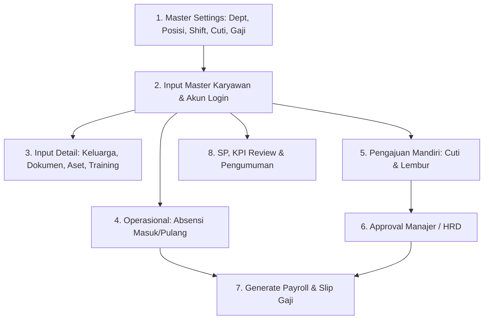

# Panduan Data Mentah (*Dummy Data*) & Lokasi Input Seluruh Fitur HRIS GASELA MOTOR

Dokumen ini berisi kumpulan **data mentah (*raw dummy data*) lengkap dan siap input** untuk seluruh modul dan fitur yang ada pada sistem **HRIS GASELA MOTOR** (Web Portal & Mobile App). Dokumen ini juga dilengkapi dengan petunjuk lokasi menu, hak akses (*role*), dan urutan input yang direkomendasikan.

---

## 📑 Daftar Isi
1. [Alur & Urutan Penginputan Data (Workflow)](#1-alur--urutan-penginputan-data-workflow)
2. [Modul Master Data & Konfigurasi (Web Portal)](#2-modul-master-data--konfigurasi-web-portal)
   - [2.1 Konfigurasi Perusahaan (Company Settings)](#21-konfigurasi-perusahaan-company-settings)
   - [2.2 Departemen / Divisi (Departments)](#22-departemen--divisi-departments)
   - [2.3 Jabatan / Posisi (Positions)](#23-jabatan--posisi-positions)
   - [2.4 Shift Kerja (Shifts)](#24-shift-kerja-shifts)
   - [2.5 Jenis Cuti & Izin (Leave Types)](#25-jenis-cuti--izin-leave-types)
   - [2.6 Komponen Gaji (Salary Components)](#26-komponen-gaji-salary-components)
   - [2.7 Hari Libur (Holidays)](#27-hari-libur-holidays)
3. [Modul Karyawan & Akun Login (Web Portal)](#3-modul-karyawan--akun-login-web-portal)
   - [3.1 Data Master Karyawan](#31-data-master-karyawan)
   - [3.2 Data Anggota Keluarga (Family Members)](#32-data-anggota-keluarga-family-members)
   - [3.3 Dokumen Karyawan (Employee Documents)](#33-dokumen-karyawan-employee-documents)
   - [3.4 Inventaris / Aset Kerja (Asset Assignments)](#34-inventaris--aset-kerja-asset-assignments)
   - [3.5 Riwayat Pelatihan (Training Records)](#35-riwayat-pelatihan-training-records)
4. [Modul Presensi & Absensi (Mobile & Web)](#4-modul-presensi--absensi-mobile--web)
   - [4.1 Presensi Harian Mandiri (Mobile App)](#41-presensi-harian-mandiri-mobile-app)
   - [4.2 Koreksi / Input Manual Absensi (Web Portal)](#42-koreksi--input-manual-absensi-web-portal)
5. [Modul Pengajuan & Persetujuan Cuti (Mobile & Web)](#5-modul-pengajuan--persetujuan-cuti-mobile--web)
   - [5.1 Pengajuan Cuti Mandiri (Mobile App)](#51-pengajuan-cuti-mandiri-mobile-app)
   - [5.2 Persetujuan / Approval Cuti (Web Portal)](#52-persetujuan--approval-cuti-web-portal)
6. [Modul Pengajuan & Persetujuan Lembur (Mobile & Web)](#6-modul-pengajuan--persetujuan-lembur-mobile--web)
   - [6.1 Pengajuan Lembur / SPL (Mobile App)](#61-pengajuan-lembur--spl-mobile-app)
   - [6.2 Persetujuan / Approval Lembur (Web Portal)](#62-persetujuan--approval-lembur-web-portal)
7. [Modul Disiplin & Surat Peringatan / SP (Web Portal)](#7-modul-disiplin--surat-peringatan--sp-web-portal)
8. [Modul Evaluasi Kinerja / KPI (Web Portal)](#8-modul-evaluasi-kinerja--kpi-web-portal)
9. [Modul Pengumuman Perusahaan (Web & Mobile)](#9-modul-pengumuman-perusahaan-web--mobile)
10. [Modul Penggajian & Slip Gaji (Web & Mobile)](#10-modul-penggajian--slip-gaji-web--mobile)
11. [Modul Landing Page CMS (Web Portal)](#11-modul-landing-page-cms-web-portal)
12. [Ringkasan Akun Login untuk Pengujian](#12-ringkasan-akun-login-untuk-pengujian)

---

## 1. Alur & Urutan Penginputan Data (Workflow)

Agar data tidak mengalami galat (*error*) ketergantungan relasi antar-tabel, ikuti urutan berikut:

---

## 2. Modul Master Data & Konfigurasi (Web Portal)

### 2.1 Konfigurasi Perusahaan (Company Settings)
* **Lokasi Menu**: **Web Portal** ➔ Menu **Pengaturan (Settings)** ➔ Tab **Umum / Konfigurasi Perusahaan**
* **Role**: `Superadmin` / `Admin` / `HRD`

| Nama Field / Key | Data Mentah 1 | Data Mentah 2 |
| :--- | :--- | :--- |
| **Nama Perusahaan** | `PT Gasela Motor Indonesia` | `Gasela Motor Service & Sparepart` |
| **Radius Absensi (meter)** | `50` | `100` |
| **Latitude Kantor** | `-6.208763` | `-6.214500` |
| **Longitude Kantor** | `106.845599` | `106.851200` |
| **Email Perusahaan** | `hrd@gaselamotor.co.id` | `admin@gaselamotor.co.id` |
| **No. Telepon Kantor** | `021-88997766` | `021-88997788` |
| **Toleransi Terlambat** | `15` (menit) | `10` (menit) |

---

### 2.2 Departemen / Divisi (Departments)
* **Lokasi Menu**: **Web Portal** ➔ Menu **Pengaturan (Settings)** ➔ Tab **Departemen (Departments)** ➔ Tombol **+ Tambah Departemen**
* **Role**: `Superadmin` / `Admin` / `HRD`

| Field Input | Data Mentah 1 | Data Mentah 2 | Data Mentah 3 |
| :--- | :--- | :--- | :--- |
| **Kode Departemen** | `SRV` | `SLS` | `FIN` |
| **Nama Departemen** | `Service & Workshop (Bengkel)` | `Sales & Showroom` | `Finance & Accounting` |
| **Parent Departemen** | *(Kosongkan / Root)* | *(Kosongkan / Root)* | *(Kosongkan / Root)* |
| **Status Aktif** | `Aktif (Yes)` | `Aktif (Yes)` | `Aktif (Yes)` |

---

### 2.3 Jabatan / Posisi (Positions)
* **Lokasi Menu**: **Web Portal** ➔ Menu **Pengaturan (Settings)** ➔ Tab **Posisi (Positions)** ➔ Tombol **+ Tambah Posisi**
* **Role**: `Superadmin` / `Admin` / `HRD`

| Field Input | Data Mentah 1 (Mekanik) | Data Mentah 2 (Sales) | Data Mentah 3 (Supervisor) |
| :--- | :--- | :--- | :--- |
| **Kode Posisi** | `MTC-01` | `SLS-01` | `SPV-SRV` |
| **Nama Posisi** | `Senior Mechanic` | `Sales Counter` | `Supervisor Service` |
| **Level** | `2` | `2` | `4` |
| **Gaji Minimum** | `Rp 4.800.000` | `Rp 4.500.000` | `Rp 7.000.000` |
| **Gaji Maksimum** | `Rp 6.500.000` | `Rp 6.000.000` | `Rp 9.500.000` |
| **Deskripsi Pekerjaan** | Melakukan servis berat, turun mesin, dan overhaul motor. | Melayani penjualan unit motor baru dan follow-up prospek customer. | Mengawasi alur kerja teknisi servis, QC kendaraan, dan approval perbaikan. |

---

### 2.4 Shift Kerja (Shifts)
* **Lokasi Menu**: **Web Portal** ➔ Menu **Pengaturan (Settings)** ➔ Tab **Shift Kerja (Shifts)** ➔ Tombol **+ Tambah Shift**
* **Role**: `Superadmin` / `Admin` / `HRD`

| Field Input | Data Mentah 1 (Shift Regular) | Data Mentah 2 (Shift Bengkel) | Data Mentah 3 (Shift Middle) |
| :--- | :--- | :--- | :--- |
| **Nama Shift** | `Shift Regular Showroom` | `Shift Teknisi Bengkel` | `Shift Middle/Siang` |
| **Jam Masuk** | `08:00` | `08:30` | `11:00` |
| **Jam Pulang** | `17:00` | `17:30` | `20:00` |
| **Toleransi Keterlambatan** | `15` menit | `10` menit | `15` menit |
| **Total Jam Kerja** | `8.0` jam | `8.0` jam | `8.0` jam |

---

### 2.5 Jenis Cuti & Izin (Leave Types)
* **Lokasi Menu**: **Web Portal** ➔ Menu **Pengaturan (Settings)** ➔ Tab **Jenis Cuti (Leave Types)** ➔ Tombol **+ Tambah Jenis Cuti**
* **Role**: `Superadmin` / `Admin` / `HRD`

| Field Input | Data Mentah 1 (Cuti Tahunan) | Data Mentah 2 (Izin Sakit) | Data Mentah 3 (Cuti Menikah) |
| :--- | :--- | :--- | :--- |
| **Kode Cuti** | `CT` | `SKT` | `NIKAH` |
| **Nama Cuti** | `Cuti Tahunan` | `Izin Sakit Surat Dokter` | `Cuti Pernikahan Karyawan` |
| **Kuota Tahunan** | `12` hari | `14` hari | `3` hari |
| **Dibayar (Is Paid)** | `Ya (Paid)` | `Ya (Paid)` | `Ya (Paid)` |
| **Wajib Lampiran Dokumen**| `Tidak` | `Ya (Surat Dokter)` | `Ya (Undangan/Surat Nikah)` |
| **Maks Hari Berurutan** | `5` | `14` | `3` |
| **Minimal Hari Pengajuan**| `3` hari sebelumnya | `0` (Hari H) | `7` hari sebelumnya |

---

### 2.6 Komponen Gaji (Salary Components)
* **Lokasi Menu**: **Web Portal** ➔ Menu **Pengaturan (Settings)** ➔ Tab **Komponen Gaji** ➔ Tombol **+ Tambah Komponen**
* **Role**: `Superadmin` / `Admin` / `HRD`

| Field Input | Data Mentah 1 (Tunjangan Transport) | Data Mentah 2 (Insentif Sales) | Data Mentah 3 (Potongan Terlambat) |
| :--- | :--- | :--- | :--- |
| **Kode Komponen** | `T-TRP` | `T-INS` | `P-LATE` |
| **Nama Komponen** | `Tunjangan Uang Transport` | `Insentif Target Service & Sales` | `Potongan Terlambat Absen` |
| **Tipe** | `allowance` (Tunjangan) | `allowance` (Tunjangan) | `deduction` (Potongan) |
| **Metode Hitung** | `fixed` (Nominal Tetap) | `fixed` / `percentage` | `formula` / `fixed` |
| **Nominal Default** | `Rp 500.000` | `Rp 750.000` | `Rp 50.000` |
| **Kena Pajak (Is Taxable)** | `Ya` | `Ya` | `Tidak` |

---

### 2.7 Hari Libur (Holidays)
* **Lokasi Menu**: **Web Portal** ➔ Menu **Pengaturan (Settings)** ➔ Tab **Hari Libur (Holidays)** ➔ Tombol **+ Tambah Libur**
* **Role**: `Superadmin` / `Admin` / `HRD`

| Field Input | Data Mentah 1 | Data Mentah 2 | Data Mentah 3 |
| :--- | :--- | :--- | :--- |
| **Tanggal Libur** | `2026-09-16` | `2026-12-25` | `2027-01-01` |
| **Nama Hari Libur** | `Maulid Nabi Muhammad SAW` | `Hari Raya Natal` | `Tahun Baru Masehi 2027` |
| **Berulang Tahunan** | `Tidak` | `Ya` | `Ya` |

---

## 3. Modul Karyawan & Akun Login (Web Portal)

### 3.1 Data Master Karyawan
* **Lokasi Menu**: **Web Portal** ➔ Menu **Karyawan (Employees)** ➔ Tombol **+ Tambah Karyawan**
* **Role**: `Superadmin` / `Admin` / `HRD`

#### 👤 Karyawan 1 (Supervisor Service / Manajer)
* **Nomor Karyawan (NIK)**: `GSL-2024-001`
* **Nama Lengkap**: `Budi Santoso, S.T.`
* **Email**: `budi.santoso@gaselamotor.co.id`
* **No. Handphone**: `081234567890`
* **Tanggal Lahir**: `1988-05-14`
* **No. KTP**: `3275011405880001`
* **No. NPWP**: `84.123.456.7-412.000`
* **Alamat**: `Jl. Boulevard Raya Blok A No. 12, Bekasi`
* **Kontak Darurat**: `Siti Rahmawati (Istri) - 081298765432`
* **Departemen**: `Service & Workshop (Bengkel)`
* **Posisi / Jabatan**: `Supervisor Service`
* **Atasan Langsung**: *(Kosongkan / Direktur)*
* **Tanggal Masuk (Join Date)**: `2022-01-10`
* **Status Kerja**: `active` | **Tipe**: `permanent`
* **Status PTKP**: `K1` (Kawin 1 Anak)
* **Gaji Pokok**: `Rp 8.000.000`
* **Data Bank**: Bank: `BCA` | No Rekening: `7820112345` | A/N: `Budi Santoso`
* **Akun Login**:
  - Username: `budi.spv`
  - Password: `Password123!`
  - Role: `manager`

---

#### 👤 Karyawan 2 (Senior Mechanic / Karyawan Bengkel)
* **Nomor Karyawan (NIK)**: `GSL-2024-002`
* **Nama Lengkap**: `Rian Pratama`
* **Email**: `rian.pratama@gaselamotor.co.id`
* **No. Handphone**: `085678901234`
* **Tanggal Lahir**: `1996-08-20`
* **No. KTP**: `3275022008960003`
* **No. NPWP**: `91.234.567.8-412.000`
* **Alamat**: `Jl. Melati No. 45 RT 02/05, Tambun Selatan`
* **Kontak Darurat**: `Bambang Pratama (Ayah) - 085712345678`
* **Departemen**: `Service & Workshop (Bengkel)`
* **Posisi / Jabatan**: `Senior Mechanic`
* **Atasan Langsung**: `Budi Santoso, S.T.`
* **Tanggal Masuk (Join Date)**: `2023-03-01`
* **Status Kerja**: `active` | **Tipe**: `permanent`
* **Status PTKP**: `TK0` (Lajang)
* **Gaji Pokok**: `Rp 5.200.000`
* **Data Bank**: Bank: `Mandiri` | No Rekening: `1560012345678` | A/N: `Rian Pratama`
* **Akun Login**:
  - Username: `rian.mekanik`
  - Password: `Password123!`
  - Role: `employee`

---

#### 👤 Karyawan 3 (Sales Counter Showroom)
* **Nomor Karyawan (NIK)**: `GSL-2024-003`
* **Nama Lengkap**: `Annisa Putri Maharani`
* **Email**: `annisa.putri@gaselamotor.co.id`
* **No. Handphone**: `087812345678`
* **Tanggal Lahir**: `1999-11-05`
* **No. KTP**: `3275034511990002`
* **No. NPWP**: `72.345.678.9-412.000`
* **Alamat**: `Perumahan Grand Galaxy Blok F No. 8, Bekasi Barat`
* **Kontak Darurat**: `Dewi Anggraini (Ibu) - 087899887766`
* **Departemen**: `Sales & Showroom`
* **Posisi / Jabatan**: `Sales Counter`
* **Atasan Langsung**: *(Kosongkan atau pilih Atasan Sales)*
* **Tanggal Masuk (Join Date)**: `2024-01-15`
* **Status Kerja**: `probation` | **Tipe**: `contract`
* **Status PTKP**: `TK0` (Lajang)
* **Gaji Pokok**: `Rp 4.700.000`
* **Data Bank**: Bank: `BCA` | No Rekening: `7820998877` | A/N: `Annisa Putri Maharani`
* **Akun Login**:
  - Username: `annisa.sales`
  - Password: `Password123!`
  - Role: `employee`

---

### 3.2 Data Anggota Keluarga (Family Members)
* **Lokasi Menu**: **Web Portal** ➔ Menu **Karyawan** ➔ Klik salah satu Karyawan ➔ Buka Tab **Keluarga (Family)** ➔ Tombol **+ Tambah Keluarga**
* **Role**: `Admin` / `HRD`

| Karyawan | Nama Anggota | Hubungan | Tgl Lahir | Gender | Tanggungan BPJS |
| :--- | :--- | :--- | :--- | :--- | :--- |
| **Budi Santoso** | `Siti Rahmawati` | `spouse` (Istri) | `1990-03-12` | `female` | `Ya (True)` |
| **Budi Santoso** | `Alvaro Santoso` | `child` (Anak) | `2018-07-22` | `male` | `Ya (True)` |
| **Rian Pratama** | `Bambang Pratama` | `parent` (Orang Tua)| `1965-01-10` | `male` | `Tidak (False)` |

---

### 3.3 Dokumen Karyawan (Employee Documents)
* **Lokasi Menu**: **Web Portal** ➔ Menu **Karyawan** ➔ Klik salah satu Karyawan ➔ Buka Tab **Dokumen (Documents)** ➔ Tombol **+ Unggah Dokumen**
* **Role**: `Admin` / `HRD`

| Karyawan | Tipe Dokumen | Nama Dokumen / File | Tgl Upload | Masa Berlaku (Expiry Date) |
| :--- | :--- | :--- | :--- | :--- |
| **Rian Pratama** | `ktp` | `Scan_KTP_Rian_Pratama.pdf` | `2024-01-10` | *(Kosongkan / Seumur Hidup)* |
| **Rian Pratama** | `sertifikat` | `Sertifikasi_Teknisi_Injeksi_Motor.pdf` | `2024-02-01` | `2027-02-01` |
| **Annisa Putri** | `kontrak` | `Surat_Perjanjian_Kerja_PKWT_Annisa.pdf`| `2024-01-15` | `2025-01-15` |

---

### 3.4 Inventaris / Aset Kerja (Asset Assignments)
* **Lokasi Menu**: **Web Portal** ➔ Menu **Karyawan** ➔ Klik salah satu Karyawan ➔ Buka Tab **Aset / Inventaris** ➔ Tombol **+ Serahkan Aset**
* **Role**: `Admin` / `HRD`

| Karyawan | Nama Aset | Kode Aset | Serial Number | Tanggal Penyerahan | Status & Catatan |
| :--- | :--- | :--- | :--- | :--- | :--- |
| **Rian Pratama** | `1 Set Toolkit Mekanik Pro` | `AST-TLS-004` | `TOOL-BOSCH-8821` | `2023-03-05` | `assigned` - Kondisi Baru & Lengkap |
| **Annisa Putri** | `Tablet Sales Samsung Galaxy Tab A9` | `AST-TAB-012` | `SM-X210-9932148` | `2024-01-20` | `assigned` - Dilengkapi casing anti bentur |
| **Budi Santoso** | `Laptop Lenovo ThinkPad E14` | `AST-LPT-003` | `LNV-TP-449102` | `2022-01-15` | `assigned` - Charger & Mouse |

---

### 3.5 Riwayat Pelatihan (Training Records)
* **Lokasi Menu**: **Web Portal** ➔ Menu **Karyawan** ➔ Klik salah satu Karyawan ➔ Buka Tab **Pelatihan (Training)** ➔ Tombol **+ Tambah Pelatihan**
* **Role**: `Admin` / `HRD`

| Karyawan | Nama Pelatihan | Penyelenggara | Periode Tgl | Total Jam | Biaya Pelatihan |
| :--- | :--- | :--- | :--- | :--- | :--- |
| **Rian Pratama** | `Troubleshooting Injeksi & Kelistrikan Motor Matik` | `Pusat Pelatihan Mitra Astra & Yamaha` | `2024-04-10` s/d `2024-04-12` | `24` Jam | `Rp 1.500.000` |
| **Annisa Putri** | `Service Excellence & Closing Skill for Showroom` | `MarkPlus Automotive Academy` | `2024-02-20` s/d `2024-02-21` | `16` Jam | `Rp 1.200.000` |

---

## 4. Modul Presensi & Absensi (Mobile & Web)

### 4.1 Presensi Harian Mandiri (Mobile App)
* **Lokasi Menu**: **Aplikasi Mobile** ➔ Login sebagai `rian.mekanik` atau `annisa.sales` ➔ Buka Menu **Presensi / Absensi**
* **Langkah Input**:
  1. Pastikan GPS handphone aktif dan berada dalam radius kantor Gasela Motor.
  2. Tekan tombol **Clock In (Masuk)** di pagi hari.
  3. Lakukan pemindaian wajah (*Face Scan*) melalui kamera depan.
  4. Tekan tombol **Clock Out (Pulang)** di sore/malam hari saat jam kerja usai.

---

### 4.2 Koreksi / Input Manual Absensi (Web Portal)
* **Lokasi Menu**: **Web Portal** ➔ Menu **Absensi (Attendance)** ➔ Tombol **+ Tambah / Edit Absensi**
* **Role**: `Superadmin` / `Admin` / `HRD`

| Field Input | Data Mentah 1 (Tepat Waktu) | Data Mentah 2 (Terlambat) | Data Mentah 3 (Izin Sakit) |
| :--- | :--- | :--- | :--- |
| **Karyawan** | `Rian Pratama` | `Annisa Putri Maharani` | `Rian Pratama` |
| **Tanggal** | `2026-09-08` | `2026-09-08` | `2026-09-05` |
| **Shift** | `Shift Teknisi Bengkel` | `Shift Regular Showroom` | `Shift Teknisi Bengkel` |
| **Jam Masuk (Check-In)** | `08:25` | `08:48` *(Telat 18 mnt)* | *(Kosongkan)* |
| **Jam Keluar (Check-Out)**| `17:35` | `17:05` | *(Kosongkan)* |
| **Status Absensi** | `present` (Hadir) | `late` (Terlambat) | `leave` (Izin Sakit) |
| **Catatan (Notes)** | `Servis motor ramai lancar` | `Terjebak macet perlintasan KA` | `Izin sakit tifus (ada surat dokter)` |

---

## 5. Modul Pengajuan & Persetujuan Cuti (Mobile & Web)

### 5.1 Pengajuan Cuti Mandiri (Mobile App)
* **Lokasi Menu**: **Aplikasi Mobile** ➔ Login sebagai Karyawan ➔ Buka Menu **Cuti (Leave)** ➔ Tombol **+ Ajukan Cuti** *(Bisa juga via Web Portal di Menu Pengajuan Cuti)*
* **Role**: `Employee`

| Field Input | Data Mentah 1 (Cuti Tahunan) | Data Mentah 2 (Izin Sakit) |
| :--- | :--- | :--- |
| **Nama Pengaju** | `Rian Pratama` (Login `rian.mekanik`) | `Annisa Putri Maharani` (Login `annisa.sales`) |
| **Jenis Cuti** | `Cuti Tahunan (CT)` | `Izin Sakit Surat Dokter (SKT)` |
| **Tanggal Mulai** | `2026-09-15` | `2026-09-22` |
| **Tanggal Selesai** | `2026-09-16` | `2026-09-23` |
| **Total Hari** | `2` hari | `2` hari |
| **Alasan Cuti** | `Acara syukuran keluarga di kampung halaman` | `Demam tinggi dan flu berat, istirahat rawat jalan` |
| **Lampiran Dokumen** | *(Tidak wajib)* | Unggah file contoh: `Surat_Dokter.jpg` |

---

### 5.2 Persetujuan / Approval Cuti (Web Portal)
* **Lokasi Menu**: **Web Portal** ➔ Menu **Persetujuan (Approvals)** atau Menu **Cuti (Leave)**
* **Role**: Login sebagai `budi.spv` (Manager) atau `Admin`/`HRD`
* **Aksi**: Cari data pengajuan cuti di atas, lalu klik tombol **Setujui (Approve)** atau **Tolak (Reject)**.

---

## 6. Modul Pengajuan & Persetujuan Lembur (Mobile & Web)

### 6.1 Pengajuan Lembur / SPL (Mobile App)
* **Lokasi Menu**: **Aplikasi Mobile** ➔ Login sebagai Karyawan ➔ Buka Menu **Lembur (Overtime)** ➔ Tombol **+ Ajukan Lembur**
* **Role**: `Employee`

| Field Input | Data Mentah 1 (Lembur Bengkel) | Data Mentah 2 (Lembur Showroom) |
| :--- | :--- | :--- |
| **Nama Pengaju** | `Rian Pratama` | `Annisa Putri Maharani` |
| **Tanggal Lembur** | `2026-09-10` | `2026-09-30` |
| **Jam Mulai** | `17:30` | `17:00` |
| **Jam Selesai** | `20:30` | `21:00` |
| **Total Jam** | `3.0` jam | `4.0` jam |
| **Alasan / Uraian Tugas** | `Menyelesaikan overhaul 3 motor customer yang harus diambil besok pagi.` | `Stock opname unit motor showroom dan rekonsiliasi faktur leasing.` |

---

### 6.2 Persetujuan / Approval Lembur (Web Portal)
* **Lokasi Menu**: **Web Portal** ➔ Menu **Persetujuan (Approvals)** atau Menu **Lembur (Overtime)**
* **Role**: Login sebagai `budi.spv` (Manager) atau `Admin`/`HRD` ➔ Klik **Setujui (Approve)**.

---

## 7. Modul Disiplin & Surat Peringatan / SP (Web Portal)
* **Lokasi Menu**: **Web Portal** ➔ Menu **Disiplin (Discipline / SP)** ➔ Tombol **+ Buat Surat Peringatan**
* **Role**: `Superadmin` / `Admin` / `HRD`

| Field Input | Data Mentah 1 (SP 1 Keterlambatan) | Data Mentah 2 (SP 2 Kelalaian Prosedur) |
| :--- | :--- | :--- |
| **Karyawan Terkait** | `Annisa Putri Maharani` | `Rian Pratama` |
| **Nomor Surat** | `SP/GSL/2026/09/001` | `SP/GSL/2026/09/002` |
| **Tingkat SP** | `SP1` | `SP2` |
| **Alasan Pelanggaran** | `Keterlambatan masuk kerja lebih dari 5 kali dalam periode 1 bulan tanpa pemberitahuan resmi.` | `Kelalaian pengencangan baut oli mesin saat servis yang mengakibatkan kebocoran oli customer.` |
| **Tanggal Terbit** | `2026-09-01` | `2026-09-05` |
| **Berlaku Hingga** | `2027-03-01` (6 bulan) | `2027-03-05` (6 bulan) |
| **Diterbitkan Oleh** | `Budi Santoso, S.T.` / `HRD Gasela` | `Budi Santoso, S.T.` |
| **Lampiran Dokumen** | `Surat_SP1_Annisa_Putri.pdf` | `Surat_SP2_Rian_Pratama.pdf` |

---

## 8. Modul Evaluasi Kinerja / KPI (Web Portal)
* **Lokasi Menu**: **Web Portal** ➔ Menu **Penilaian Kinerja (Performance Reviews)** ➔ Tombol **+ Buat Penilaian**
* **Role**: `Manager` / `HRD` / `Admin`

| Field Input | Data Mentah 1 (Evaluasi Mekanik) | Data Mentah 2 (Evaluasi Sales) |
| :--- | :--- | :--- |
| **Karyawan yang Dinilai** | `Rian Pratama` | `Annisa Putri Maharani` |
| **Penilai (Reviewer)** | `Budi Santoso, S.T.` | `Budi Santoso, S.T.` |
| **Periode Bulan & Tahun** | Bulan `8` (Agustus), Tahun `2026` | Bulan `8` (Agustus), Tahun `2026` |
| **Tanggal Penilaian** | `2026-09-02` | `2026-09-03` |
| **Skor Keseluruhan (0-100)**| `88.50` | `82.00` |
| **Kelebihan (Strengths)** | Sangat cepat dalam diagnosa kerusakan mesin injeksi, teliti, dan ramah saat konsultasi teknis dengan customer. | Komunikasi persuasif sangat baik, target penjualan unit motor matik tercapai 110%, selalu rapi dalam pencatatan prospek. |
| **Area Perbaikan** | Perlu meningkatkan kecepatan administrasi pencatatan sparepart yang digunakan di sistem bengkel. | Tingkatkan kedisiplinan jam kehadiran di pagi hari sebelum showroom dibuka. |
| **Target Periode Depan** | Mengikuti pelatihan sertifikasi motor listrik dan mempertahankan zero customer complain. | Mencapai target penjualan 15 unit motor per bulan dan follow-up database leasing aktif. |
| **Status Review** | `completed` | `completed` |

---

## 9. Modul Pengumuman Perusahaan (Web & Mobile)
* **Lokasi Input**: **Web Portal** ➔ Menu **Pengumuman (Announcements)** ➔ Tombol **+ Buat Pengumuman**
* **Lokasi Baca**: **Mobile App** ➔ Menu **Pengumuman (Announcements)**
* **Role Penginput**: `Superadmin` / `Admin` / `HRD`

| Field Input | Data Mentah 1 (Libur Operasional) | Data Mentah 2 (Promo Showroom) |
| :--- | :--- | :--- |
| **Judul Pengumuman** | `Jadwal Operasional Bengkel & Showroom Libur Maulid Nabi` | `Target Promo Spesial DP Ringan & Pelayanan Customer Servis` |
| **Prioritas** | `high` (Tinggi) | `normal` (Normal) |
| **Target Audiens** | `all` (Semua Karyawan) | `department` ➔ Pilih `Sales & Showroom` |
| **Tanggal Terbit** | `2026-09-08` | `2026-09-09` |
| **Tanggal Berakhir** | `2026-09-17` | `2026-09-30` |
| **Isi Konten** | Diberitahukan kepada seluruh karyawan PT Gasela Motor Indonesia bahwa operasional bengkel dan showroom akan libur nasional pada tanggal 16 September 2026. Bagi teknisi piket darurat harap berkoordinasi dengan Kepala Bengkel. | Mengingat dibukanya program promo DP Ringan bulan ini, diharapkan seluruh tim sales meningkatkan follow-up calon pembeli dan memastikan display unit motor di showroom selalu bersih dan siap uji coba. |
| **Status Publikasi** | `Dipublikasikan (Published: True)` | `Dipublikasikan (Published: True)` |

---

## 10. Modul Penggajian & Slip Gaji (Web & Mobile)
* **Lokasi Input & Proses**: **Web Portal** ➔ Menu **Penggajian (Payroll)** ➔ Tombol **+ Proses Gaji / Generate Payroll**
* **Lokasi Cek & Unduh**: **Mobile App** ➔ Menu **Slip Gaji (Payroll)**
* **Role Penginput**: `Superadmin` / `Admin` / `HRD`

| Field / Komponen | Data Mentah 1 (Slip Gaji Mekanik) | Data Mentah 2 (Slip Gaji Sales) |
| :--- | :--- | :--- |
| **Karyawan** | `Rian Pratama` | `Annisa Putri Maharani` |
| **Periode Bulan & Tahun** | Bulan `8`, Tahun `2026` | Bulan `8`, Tahun `2026` |
| **Gaji Pokok (Basic Salary)**| `Rp 5.200.000` | `Rp 4.700.000` |
| **Tunjangan Transport** | `Rp 500.000` | `Rp 500.000` |
| **Insentif / Lembur** | `Rp 450.000` | `Rp 350.000` |
| **BPJS Kesehatan (Perusahaan)**| `Rp 208.000` (4%) | `Rp 188.000` (4%) |
| **BPJS Ketenagakerjaan** | `Rp 324.480` | `Rp 293.280` |
| **Potongan BPJS Karyawan** | `Rp 156.000` (1% Kes + 2% JHT) | `Rp 141.000` |
| **PPh 21 (TER)** | `Rp 12.500` | `Rp 10.000` |
| **Potongan Keterlambatan** | `Rp 0` | `Rp 50.000` |
| **Gaji Bersih (Take Home Pay)**| `Rp 5.981.500` | `Rp 5.349.000` |
| **Status & Tanggal Bayar** | `paid` (Sudah Dibayar) - `2026-08-28` | `paid` (Sudah Dibayar) - `2026-08-28` |

---

## 11. Modul Landing Page CMS (Web Portal)
* **Lokasi Menu**: **Web Portal** ➔ Menu **Landing CMS (Website Publik)**
* **Role**: `Superadmin` / `Admin` / `Landing Admin`

| Bagian (Section) | Data Mentah 1 (Hero Banner) | Data Mentah 2 (Layanan Unggulan / Features) |
| :--- | :--- | :--- |
| **Section Key** | `hero` | `features` |
| **Judul Utama (Title)** | `Solusi Terpercaya Perawatan & Pembelian Motor Anda` | `Layanan Service Presisi dengan Standar Bengkel Resmi` |
| **Sub-Judul / Tagline** | Bengkel modern, sparepart 100% original, dan showroom motor pilihan bergaransi resmi Gasela Motor. | Didukung oleh teknisi tersertifikasi, alat diagnostik digital mutakhir, dan suku cadang asli bergaransi. |
| **Call To Action (CTA)** | Button: `Hubungi Kami via WhatsApp` ➔ Link: `https://wa.me/6281234567890` | Button: `Booking Servis Sekarang` ➔ Link: `#booking` |

---

## 12. Ringkasan Akun Login untuk Pengujian

Gunakan akun-akun di bawah ini untuk menguji hak akses dan tampilan fitur di **Web Portal** maupun **Mobile App**:

| Role / Jabatan | Username | Password Default | Target Platform | Fitur Utama yang Dapat Dicoba |
| :--- | :--- | :--- | :--- | :--- |
| **Superadmin / HRD** | `admin` *(atau akun admin Anda)* | `Admin123!` | **Web Portal** | Seluruh Menu Master Settings, Karyawan, Payroll, Disiplin, Laporan |
| **Manager / Kepala Bengkel** | `budi.spv` | `Password123!` | **Web & Mobile** | Approval Cuti, Approval Lembur, KPI Review, Presensi |
| **Employee / Mekanik** | `rian.mekanik` | `Password123!` | **Aplikasi Mobile** | Presensi Face Scan & GPS, Ajukan Cuti, Ajukan Lembur, Cek Slip Gaji |
| **Employee / Sales** | `annisa.sales` | `Password123!` | **Aplikasi Mobile** | Presensi Face Scan & GPS, Baca Pengumuman, Cek Slip Gaji |

---
*Dokumen ini dibuat otomatis sebagai acuan penginputan data operasional HRIS Gasela Motor.*
